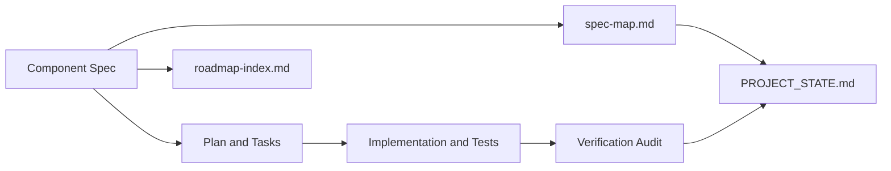

# Knot Project State

## Metadata

- Last Updated: 2026-03-03
- Purpose: Policy and orientation doc for project-wide traceability and verification entrypoints
- Workflow: bk-*

Canonical component registry: `docs/specs/system/spec-map.md`
Planning board: `docs/planning/roadmap-index.md`

## Registry Policy

- Treat each component spec in `docs/specs/component/` as the source of truth for workstream `ID`, `Status`, concerns, and acceptance criteria.
- Treat `docs/specs/system/spec-map.md` as the canonical project-wide registry view over component specs.
- Treat `docs/planning/roadmap-index.md` as a planning board only; roadmap status must not override or reinterpret component spec status.
- Avoid duplicating per-component status tables in summary docs. Summary docs should point to the registry and latest verification artifacts instead.

## Traceability Chain

## Verification Index

- `docs/audit/frontend-verification-2026-02-22.md`
- `docs/audit/storybook-dx-001-verification-2026-02-22.md`
- `docs/audit/ui-qa-dx-001-verification-2026-02-22.md`
- `docs/audit/ui-automation-dx-001-verification-2026-02-22.md`
- `docs/audit/mermaid-diagrams-001-verification-2026-02-22.md`

## Operating Notes

- If project-wide status looks inconsistent, run `npm run qa:project-registry`.
- When changing a component status, update the component spec metadata first, then align `spec-map.md`, roadmap rows, and verification artifacts.
