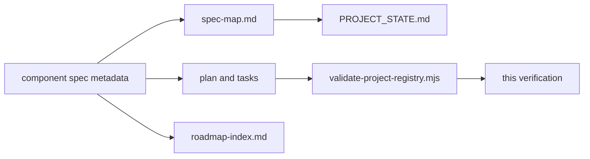

# Verification: Documentation Registry Alignment 020

## Metadata

- Spec: `docs/specs/component/documentation-registry-alignment-020.md`
- Plan: `docs/plans/documentation-registry-alignment-020-plan.md`
- Tasks: `docs/plans/documentation-registry-alignment-020-tasks.yaml`
- Date: `2026-03-03`
- Verifier: `Codex`
- Result: `pass`

## Summary

Project-wide documentation registry drift was removed by making component spec metadata the status source of truth, collapsing `docs/PROJECT_STATE.md` into a policy/index document, normalizing `docs/specs/system/spec-map.md`, correcting roadmap status drift, and adding an automated validator plus TypeScript declaration coverage.

## Requirement Results

| Requirement | Result | Evidence |
| --- | --- | --- |
| FR-1 | pass | `docs/PROJECT_STATE.md` declares the canonical registry and planning board and no longer contains a duplicate component status matrix. |
| FR-2 | pass | `npm run -s qa:project-registry` confirms every component spec row is present in `docs/specs/system/spec-map.md`. |
| FR-3 | pass | `spec-map.md` designed-component statuses now match component spec metadata exactly, including `verified` and draft rows. |
| FR-4 | pass | `docs/planning/roadmap-index.md` now states it is a planning view and no longer contradicts referenced spec status. |
| FR-5 | pass | `scripts/validate-project-registry.mjs`, `src/tooling/projectRegistry.test.ts`, and `npm run qa:project-registry` provide automated validation coverage. |
| FR-6 | pass | Registry policy and verification artifacts document the chain from component spec through plan/tasks to verification. |

## Traceability



## Verification Commands

```text
npm run test -- --run src/tooling/projectRegistry.test.ts
npm run -s qa:project-registry
npm run typecheck
```

## Results

- `npm run test -- --run src/tooling/projectRegistry.test.ts`: pass
- `npm run -s qa:project-registry`: pass
- `npm run typecheck`: pass

## Notes

- Legacy component specs that previously omitted `Status` metadata were backfilled with `implemented` to make registry validation total rather than best-effort.
- A declaration file was added for `scripts/validate-project-registry.mjs` so the validation tooling remains inside the repo quality gates.
- No product runtime code changed in this workstream.
