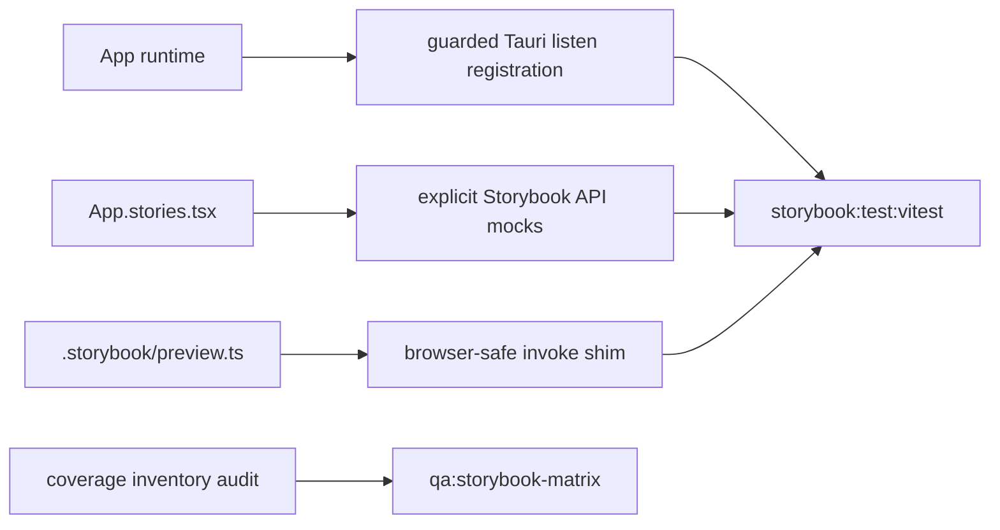

# Verification: Storybook App Stability 022

## Metadata

- Spec: `docs/specs/component/storybook-app-stability-022.md`
- Plan: `docs/plans/storybook-app-stability-022-plan.md`
- Tasks: `docs/plans/storybook-app-stability-022-tasks.yaml`
- Date: `2026-03-03`
- Verifier: `Codex`
- Result: `pass with known non-blocking App act-warning noise`

## Summary

The Storybook App suite is stable again. `App` no longer surfaces unhandled runtime failures when the Tauri UI automation listener cannot register, the App shell stories now provide explicit Tauri API/event defaults, Storybook preview supplies a safe browser-side Tauri core shim, and the Storybook coverage inventory once again matches the current story export surface enforced by `qa:storybook-matrix`.

## Baseline Failures

| Command                            | Baseline Result | Evidence                                                                                                                                                                                      |
| ---------------------------------- | --------------- | --------------------------------------------------------------------------------------------------------------------------------------------------------------------------------------------- |
| `npm run -s storybook:test:vitest` | fail            | Storybook run completed tests but exited with `49` unhandled runtime errors from `src/App.stories.tsx`, including missing `invoke` and `transformCallback` internals from Tauri browser APIs. |
| `npm run -s qa:storybook-matrix`   | fail            | Coverage inventory declared `68` story exports while the current story files exported `83`.                                                                                                   |

## Requirement Results

| Requirement | Result | Evidence                                                                                                                                                                                                                                 |
| ----------- | ------ | ---------------------------------------------------------------------------------------------------------------------------------------------------------------------------------------------------------------------------------------- |
| FR-1        | pass   | `src/App.tsx` wraps the `listen("ui-automation://request", ...)` registration in a guarded async block and logs registration failure instead of leaking an unhandled rejection. `src/App.test.tsx` adds a regression test for this path. |
| FR-2        | pass   | `src/App.stories.tsx` now mocks App shell mount-time Tauri dependencies: keymap settings, UI automation settings, registry sync, state sync, completion callbacks, and `listen`.                                                         |
| FR-3        | pass   | `.storybook/preview.ts` installs a browser-safe `window.__TAURI_INTERNALS__.invoke` shim before stories run.                                                                                                                             |
| FR-4        | pass   | `docs/audit/storybook-design-coverage-inventory-2026-02-22.md` now reports `83` story exports and includes the newer App, Editor, ToolRail, and Sidebar story exports.                                                                   |
| FR-5        | pass   | This audit records both the failing baseline commands and the final passing verification commands.                                                                                                                                       |

## Traceability



## Verification Commands

```text
npm run test -- --run src/App.test.tsx
npm run -s storybook:test:vitest
npm run -s qa:storybook-matrix
npm run typecheck
npm run -s qa:project-registry
```

## Results

- `npm run test -- --run src/App.test.tsx`: pass
- `npm run -s storybook:test:vitest`: pass (`16` files, `89` tests, `0` unhandled runtime errors)
- `npm run -s qa:storybook-matrix`: pass (`14` files, `83` story exports, `26` UI specs covered)
- `npm run typecheck`: pass
- `npm run -s qa:project-registry`: pass

## Notes

- `src/App.test.tsx` still emits existing React `act(...)` warnings in some cases. Those warnings predate this workstream and did not block the Storybook/App stabilization goal.
- `src/components/Editor/Editor.stories.tsx` still logs the expected "save failed" message in the negative-path story; that is not a suite failure.
