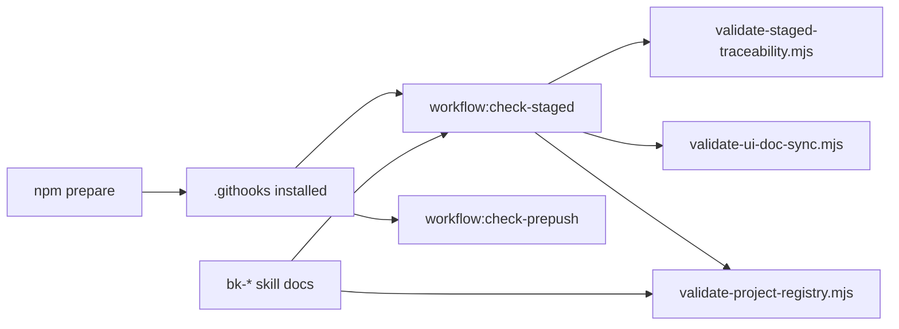

# Verification: Workflow Freshness Hardening 021

## Metadata

- Spec: `docs/specs/component/workflow-freshness-hardening-021.md`
- Plan: `docs/plans/workflow-freshness-hardening-021-plan.md`
- Tasks: `docs/plans/workflow-freshness-hardening-021-tasks.yaml`
- Date: `2026-03-03`
- Verifier: `Codex`
- Result: `pass with noted repo-wide non-blocking test instability`

## Summary

The local workflow now auto-installs hooks through npm lifecycle, pre-commit runs a composed staged workflow validator, pre-push runs a lightweight freshness gate instead of the full local CI stack, and the relevant bk-* skills now describe the same canonical registry and roadmap rules enforced by the repository validators.

## Requirement Results

| Requirement | Result | Evidence |
| --- | --- | --- |
| FR-1 | pass | `package.json` adds `prepare`, which calls `hooks:install`; `.githooks` remains the configured hook path target. |
| FR-2 | pass | `.githooks/pre-commit` now runs `workflow:check-staged`; `scripts/validate-staged-workflow.mjs` composes staged traceability, UI doc sync, and conditional staged project-registry validation. |
| FR-3 | pass | `.githooks/pre-push` now runs `workflow:check-prepush`, which resolves `BASE_REF` and executes lightweight freshness checks instead of `ci:local`. |
| FR-4 | pass | `bk-analyze`, `bk-design`, `bk-plan`, `bk-verify`, `bk-verify-completion`, and `bk-ship` now align with the canonical registry and roadmap projection policy. |
| FR-5 | pass | `src/tooling/stagedWorkflow.test.ts` covers staged workflow composition and passes. |
| FR-6 | pass | This audit documents the staged and pre-push gates introduced for workflow freshness. |

## Traceability



## Verification Commands

```text
npm run test -- --run src/tooling/stagedWorkflow.test.ts
npm run test -- --run src/tooling/projectRegistry.test.ts
npm run typecheck
npm run -s workflow:check-staged
npm run -s workflow:check-prepush
npm run -s qa:project-registry
npm run -s qa:docsync -- --against=HEAD~1
```

## Results

- `npm run test -- --run src/tooling/stagedWorkflow.test.ts`: pass
- `npm run test -- --run src/tooling/projectRegistry.test.ts`: pass
- `npm run typecheck`: pass
- `npm run -s workflow:check-staged`: pass
- `npm run -s workflow:check-prepush`: pass
- `npm run -s qa:project-registry`: pass
- `npm run -s qa:docsync -- --against=HEAD~1`: pass

## Notes

- The pre-push wrapper intentionally excludes the heavier local CI, lint, Storybook matrix, and full unit/storybook suite because the current repository has unrelated warnings/drift there. Those remain separate quality concerns, not blockers for workflow-freshness enforcement.
- During implementation, full `test:ci:unit` still reported known Storybook/App unhandled errors; this workstream kept the freshness gate scoped to stable checks rather than inheriting unrelated suite noise.
